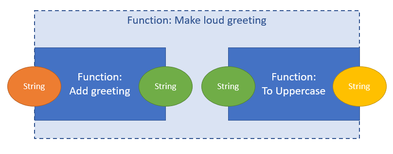

# Practical introduction to Functional Programming

In this repo I aim to showcase the different concepts used in Functional Programming compared to Imperative Programming. 
To do so we'll showcase the differences in code examples and briefly discuss the
implications.

Each chapter has a **Code Example** that works out an exercise in 3 languages (Python, Java and Scala). The results of 
these exercises can be found here:
- Python: `./python/`
- Java: `./src/main/java/java_examples/`
- Scala: `./src/main/scala/scala_examples/`

Let's start with the most obvious one and work our way towards more specific examples.

## 1. Declarative vs Imperative Programming

**Code Example**: Filter items longer then 10 characters from a list

Imperative ([Java](./src/main/java/java_examples/1_declarative_vs_imperative.java), 
[Python](./python/1_declarative_vs_imperative.py)):
- Specify list of instructions to be executed
- Easy to reason about as it can be followed step-by-step (especially for beginners)
- Close to actual execution model (von Neuman)

Declarative ([Scala](./src/main/scala/scala_examples/1_declarative_vs_imperative.scala)):
- Specify intention, declare what we want to do
- More readable code

## 2. Immutability

**Code Example**: Adding items to a map/dict

Mutable ([Java](./src/main/java/java_examples/2_immutability.java),[Python](./python/2_immutability.py)):
- Objects can be altered after creation
- Shared Mutable State Problem (state is shared and might be altered by other pieces of code)

Immutable ([Scala](./src/main/scala/scala_examples/2_immutability.scala)):
- Objects cannot be altered after creation
- Supports parallel execution naturally

### Memory management
Immutability doesn't necessarily mean more memory is used. When for instance adding items to a map, one could think
it takes up more memory since we'd have to create an entirely new map with the extra item added in an immutable object.
However this is mitigated by the fact that immutable objects can be referenced to safely from multiple objects (as they
are immutable and guaranteed not to change). So adding an element to a map could look like this:

  

## 3. Type system
Types are very useful when you're writing a functional program. In functional programming you'll often be chaining 
functions together to compose higher level functions. Types make it lot easier to do so as they make it easy to 
understand the result of previous functions. Also, the compiler can help you in determining whether the operations 
you've written are valid.

**Code Example**: Create a list of strings, parse to integers and filter < 10

Untyped ([Python](./python/3_type_system.py)):
- Flexible
- Potential type errors at run-time (more need for testing)
- Slower when reading data as the type needs to be inferred

Typed ([Java](./src/main/java/java_examples/3_type_system.java),
[Scala](./src/main/scala/scala_examples/3_type_system.scala)):
- Compile-time validation (less error-prone)
- Readability and understandability of code (types provide insight in what a function does)
- More efficient in memory as storage needs are tailored to a type

### 3.1 Type Inference

### 3.2 Pattern Matching

## 4. Functional Composition and First-class Functions
Every program essentially consists of 2 things: Behavior and Data. In Functional programming, functions make up the 
behavior of the program. They describe the transformations that need to be done on immutable data in order to achieve 
the programmers goals.

With Functions being the main building blocks of functional programs, an important concept is functional composition. 
This is a way to combine functions together to create another function and thus more complex behavior. For this to be 
possible, functions need to be so-called first-class citizens. This means you can pass functions around the same way 
you can pass data/objects/variables around in your code.

**Code Examples** ([Python](./python/4_functional_composition.py), 
[Java](./src/main/java/java_examples/4_functional_composition.java),
[Scala](./src/main/scala/scala_examples/4_functional_composition.scala)): 
- Compose a greeting from 2 functions.
  
  In this example we'll compose a greeting function. In our example we only show the first 2 functions composed. As an
  exercise you can create an ASCII greeting by adding the last function.
  
- Pass the greeting function as an argument to another function
- Create division functions by returning a function from a function

## Resources used

- http://luizsol.com/why-functional-programming/
- https://www.freecodecamp.org/news/imperative-vs-declarative-programming-difference/
- https://www.freecodecamp.org/news/learn-the-fundamentals-of-functional-programming/
- Why OOP is bad (or why encapsulation doesn't work): https://www.youtube.com/watch?v=QM1iUe6IofM&ab_channel=BrianWill
